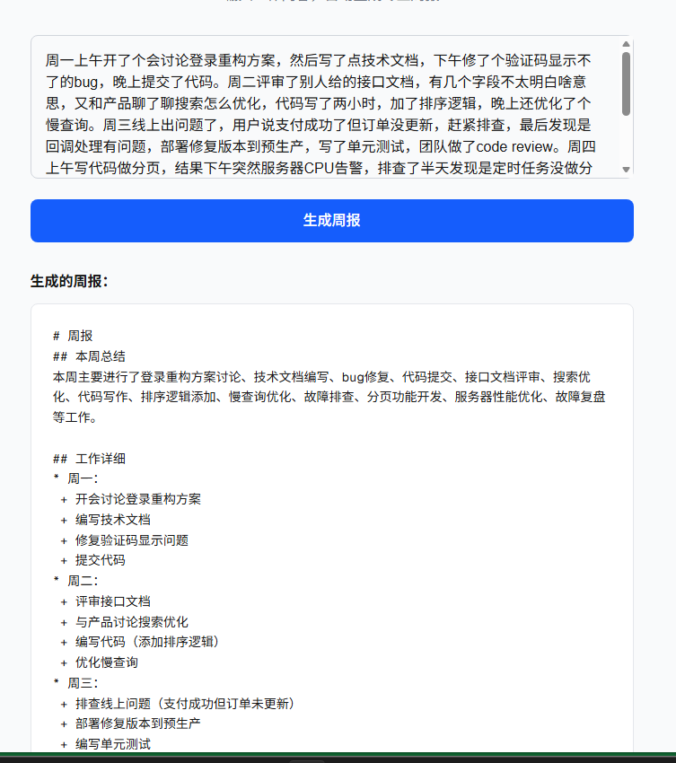

# 周报生成器

输入杂乱的工作内容，自动生成格式规范的周报。



## 在线体验

https://weekly-report-generator-three.vercel.app

## 功能

- 输入一周的杂乱工作内容
- 自动整理生成结构化周报
- 支持 Markdown 格式导出

## 技术栈

- Next.js 16 + TypeScript
- Tailwind CSS
- Groq API (Llama 3.3 70B)
- Vercel 部署

## 本地开发

```bash
npm install
npm run dev
```

## 项目记录

见 [PROJECT_RECORD.md](./PROJECT_RECORD.md)
